# ERP 마이크로서비스 시스템 개발 보고서

---

**과목명**: 고급 프로그래밍 실습

**제출일**: 2025년 12월 11일

---

## 목차

1. 시스템 개요 및 기술 스택
2. 전체 아키텍처
3. 서비스 간 통신 흐름
4. REST API 명세
5. gRPC 프로토콜 및 Kafka 메시징
6. 데이터베이스 설계
7. 환경 구성 및 실행 방법
8. 테스트 및 개발 과정
9. 확장 기능 구현

---

## 1. 시스템 개요 및 기술 스택

### 1.1 프로젝트 목적

본 프로젝트는 기업 내 전자결재 업무를 처리하는 ERP(Enterprise Resource Planning) 시스템을 마이크로서비스 아키텍처로 구현한다. 직원 관리, 결재 요청, 결재 처리, 실시간 알림 기능을 각각 독립된 서비스로 분리하여 확장성과 유지보수성을 확보하였다.

### 1.2 주요 기능

| 기능 구분 | 세부 기능 | 설명 |
|----------|----------|------|
| 직원 관리 | CRUD | 직원 정보 등록, 조회, 수정, 삭제 |
| | 부서/직급 필터링 | 부서별, 직급별 직원 조회 |
| 결재 요청 | 다단계 결재선 | 최대 4단계까지 결재선 설정 가능 |
| | 결재 수정 | 진행 중인 결재 요청 수정 (이력 추적) |
| | 결재 취소 | 결재 요청자가 진행 중인 결재 취소 |
| | 결재선 템플릿 | 자주 사용하는 결재선 저장/불러오기 |
| 결재 처리 | 승인/반려 | 결재자별 승인 또는 반려 처리 |
| | 승인 철회 | 이미 승인한 결재 철회 기능 |
| | 결재 기한 | 기한 설정 및 초과 표시 |
| 실시간 알림 | WebSocket 알림 | 결재 결과 즉시 통보 |
| | 새 결재 알림 | 새로운 결재 요청 도착 알림 |
| 통계 | 대시보드 | 승인/반려/대기 건수 집계 |

### 1.3 기술 스택

| 구분 | 기술 | 버전 | 용도 |
|------|------|------|------|
| 언어 | Java | 17 | 백엔드 개발 |
| 프레임워크 | Spring Boot | 3.2.0 | 마이크로서비스 프레임워크 |
| 관계형 DB | MySQL | 8.0 | 직원 데이터 저장 |
| NoSQL | MongoDB | 7.0 | 결재 요청 문서 저장 |
| 메시징 | Apache Kafka | 3.x | 비동기 서비스 간 통신 |
| RPC | gRPC | - | 서비스 간 통신 프로토콜 정의 |
| 프론트엔드 | Thymeleaf | - | 서버사이드 템플릿 |
| | Bootstrap | 5.x | UI 프레임워크 |
| 컨테이너 | Docker | - | 인프라 컨테이너화 |
| | Kubernetes | - | 컨테이너 오케스트레이션 |

---

## 2. 전체 아키텍처

### 2.1 시스템 아키텍처 다이어그램

본 시스템은 5개의 마이크로서비스로 구성되며, Kafka를 통한 비동기 메시징과 WebSocket을 통한 실시간 알림을 지원한다.


**그림 2-0. 시스템 아키텍처 다이어그램**

- **Client (Browser)**: 사용자 인터페이스, WebSocket 실시간 알림 수신
- **Web Service (:8000)**: Thymeleaf + Bootstrap UI, 각 서비스로 요청 라우팅
- **Employee Service (:8081)**: 직원 CRUD, MySQL 연동
- **Approval Request Service (:8082)**: 결재 요청 관리, MongoDB 연동, Kafka 발행/구독
- **Approval Processing Service (:8083)**: 결재 처리, In-Memory 대기열, Kafka 발행/구독
- **Notification Service (:8080)**: WebSocket 실시간 알림, Kafka 구독
- **Apache Kafka (:9092)**: 비동기 메시징 (approval-requests, approval-results 토픽)

### 2.2 Docker 컨테이너 실행 상태

아래는 `docker compose ps` 명령으로 확인한 인프라 컨테이너 실행 상태이다.


**그림 2-1. Docker 컨테이너 실행 상태**

- MySQL, MongoDB, Kafka, Zookeeper 4개의 컨테이너가 정상 실행 중
- 각 컨테이너는 호스트 포트와 매핑되어 로컬 개발 환경에서 접근 가능

### 2.3 서비스 구성 상세

| 서비스명 | 포트 | 역할 | 데이터 저장소 | 통신 방식 |
|----------|------|------|---------------|-----------|
| Employee Service | 8081 | 직원 정보 관리 | MySQL | REST API |
| Approval Request Service | 8082 | 결재 요청 CRUD, 상태 관리 | MongoDB | REST API, Kafka |
| Approval Processing Service | 8083 | 결재 대기열, 승인/반려 처리 | In-Memory | REST API, Kafka |
| Notification Service | 8080 | 실시간 알림 전송 | In-Memory | REST API, WebSocket |
| Web Service | 8000 | 사용자 인터페이스 | - | REST Client |

### 2.4 대시보드 서비스 상태 모니터링


**그림 2-2. 대시보드의 서비스 상태 모니터링 화면**

- 각 서비스의 포트별 실행 상태를 실시간으로 확인
- 정상 실행 시 녹색 배지로 표시
- 서비스 장애 시 빠른 파악 가능

---

## 3. 서비스 간 통신 흐름

### 3.1 결재 요청 생성 흐름

```
1. 사용자 → Web Service: 결재 요청 폼 제출
2. Web Service → Approval Request Service: POST /approvals
3. Approval Request Service → MongoDB: 결재 요청 저장
4. Approval Request Service → Kafka: approval-requests 토픽 발행
5. Approval Processing Service ← Kafka: 메시지 수신
6. Approval Processing Service → In-Memory: 결재자별 대기열에 추가
```

### 3.2 결재 승인/반려 흐름

```
1. 결재자 → Web Service: 승인/반려 버튼 클릭
2. Web Service → Approval Processing Service: POST /process/{approverId}/{requestId}
3. Approval Processing Service: 대기열에서 제거, 상태 변경
4. Approval Processing Service → Kafka: approval-results 토픽 발행
5. Approval Request Service ← Kafka: 결과 메시지 수신
6. Approval Request Service → MongoDB: finalStatus 업데이트
7. Approval Request Service → Notification Service: POST /notify/{employeeId}
8. Notification Service → 요청자: WebSocket 알림 전송
```

### 3.3 시퀀스 다이어그램

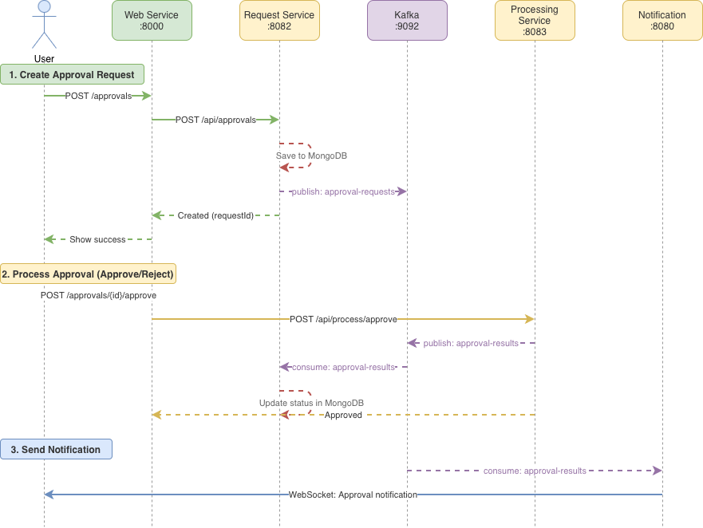

**그림 3-1. 결재 승인 흐름 시퀀스 다이어그램**

1. **결재 요청 생성 (Phase 1)**
   - User → Web Service → Request Service로 결재 요청 전송
   - Request Service가 MongoDB에 저장 후 Kafka에 publish
   - Processing Service가 Kafka에서 consume하여 대기열에 추가

2. **결재 승인 처리 (Phase 2)**
   - 결재자 → Web Service → Processing Service로 승인/반려 요청
   - Processing Service가 결과를 Kafka에 publish
   - Request Service가 consume하여 MongoDB 상태 업데이트

3. **알림 전송 (Phase 3)**
   - Notification Service가 Kafka에서 결과 consume
   - WebSocket을 통해 요청자에게 실시간 알림 전송

---

## 4. REST API 명세

### 4.1 Employee Service (포트: 8081)

**Base URL:** `http://localhost:8081`

| Method | Endpoint | 설명 | 요청 본문 | 응답 |
|--------|----------|------|----------|------|
| POST | /employees | 직원 생성 | CreateEmployeeRequest | Employee |
| GET | /employees | 직원 목록 조회 | - | List\<Employee\> |
| GET | /employees/{id} | 직원 상세 조회 | - | Employee |
| PUT | /employees/{id} | 직원 정보 수정 | UpdateEmployeeRequest | Employee |
| DELETE | /employees/{id} | 직원 삭제 | - | - |
| GET | /employees/{id}/exists | 직원 존재 여부 확인 | - | Boolean |

**직원 생성 요청 예시:**
```json
POST /employees
Content-Type: application/json

{
    "name": "홍길동",
    "department": "개발팀",
    "position": "팀장"
}
```

**응답:**
```json
{
    "id": 1,
    "name": "홍길동",
    "department": "개발팀",
    "position": "팀장",
    "createdAt": "2025-12-06T09:00:00"
}
```

### 4.2 Approval Request Service (포트: 8082)

**Base URL:** `http://localhost:8082`

| Method | Endpoint | 설명 | 요청 본문 |
|--------|----------|------|----------|
| POST | /approvals | 결재 요청 생성 | CreateApprovalRequest |
| GET | /approvals | 결재 요청 목록 조회 | - |
| GET | /approvals/{requestId} | 결재 요청 상세 조회 | - |
| PUT | /approvals/{requestId} | 결재 요청 수정 | UpdateApprovalRequest |
| POST | /approvals/{requestId}/cancel | 결재 요청 취소 | - |
| POST | /approvals/{requestId}/steps/{step}/withdraw | 승인 철회 | - |
| GET | /approvals/statistics | 결재 통계 조회 | - |
| POST | /approvals/sync | Processing Service 동기화 | - |

**결재선 템플릿 API:**

| Method | Endpoint | 설명 |
|--------|----------|------|
| POST | /templates | 템플릿 생성 |
| GET | /templates | 템플릿 목록 |
| GET | /templates/{id} | 템플릿 상세 |
| DELETE | /templates/{id} | 템플릿 삭제 |

**결재 요청 생성 예시:**
```json
POST /approvals
Content-Type: application/json

{
    "requesterId": 1,
    "title": "휴가 신청",
    "content": "연차 3일 사용합니다.\n기간: 12월 20일 ~ 12월 22일",
    "steps": [
        {"step": 1, "approverId": 2},
        {"step": 2, "approverId": 3}
    ],
    "deadline": "2025-12-10T18:00:00"
}
```

### 4.3 Approval Processing Service (포트: 8083)

**Base URL:** `http://localhost:8083`

| Method | Endpoint | 설명 | 요청 본문 |
|--------|----------|------|----------|
| GET | /process/{approverId} | 결재자의 대기 목록 조회 | - |
| POST | /process/{approverId}/{requestId} | 승인/반려 처리 | ProcessRequest |

### 4.4 Notification Service (포트: 8080)

**Base URL:** `http://localhost:8080`

| Method | Endpoint | 설명 |
|--------|----------|------|
| POST | /notify/{employeeId} | 특정 직원에게 알림 전송 |
| GET | /notify/{employeeId}/status | WebSocket 연결 상태 확인 |
| WebSocket | /ws?id={employeeId} | 실시간 알림 연결 |

---

## 5. gRPC 프로토콜 및 Kafka 메시징

### 5.1 Proto 파일 정의

**파일 위치:** `proto/approval.proto`

```protobuf
syntax = "proto3";
package approval;

option java_multiple_files = true;
option java_package = "com.erp.grpc";

// 결재 서비스 정의
service ApprovalService {
    // 새 결재 요청 전송
    rpc RequestApproval(ApprovalRequest) returns (ApprovalResponse);

    // 결재 결과 반환
    rpc ReturnApprovalResult(ApprovalResultRequest) returns (ApprovalResultResponse);
}

// 결재 단계 정보
message Step {
    int32 step = 1;          // 단계 번호 (1, 2, 3, ...)
    int32 approverId = 2;    // 결재자 ID
    string status = 3;       // 상태: pending, approved, rejected
}

// 결재 요청 메시지
message ApprovalRequest {
    int32 requestId = 1;      // 결재 요청 ID
    int32 requesterId = 2;    // 요청자 ID
    string title = 3;         // 제목
    string content = 4;       // 내용
    repeated Step steps = 5;  // 결재 단계 목록
}

// 결재 요청 응답
message ApprovalResponse {
    string status = 1;        // 처리 상태: success, fail
}

// 결재 결과 요청 메시지
message ApprovalResultRequest {
    int32 requestId = 1;      // 결재 요청 ID
    int32 step = 2;           // 처리된 단계
    int32 approverId = 3;     // 결재자 ID
    string status = 4;        // 결과: approved, rejected
}

// 결재 결과 응답
message ApprovalResultResponse {
    string status = 1;        // 처리 상태
}
```

### 5.2 gRPC에서 Kafka로의 전환

초기 구현에서는 gRPC를 사용한 동기 통신 방식이었으나, 다음과 같은 문제점이 발견되어 Kafka 비동기 메시징으로 전환하였다:

| 구분 | gRPC (동기) | Kafka (비동기) |
|------|-------------|----------------|
| 결합도 | 강결합 (서비스 직접 호출) | 약결합 (메시지 브로커 통해 통신) |
| 장애 전파 | Processing Service 장애 시 Request Service도 영향 | 서비스 간 장애 격리 |
| 확장성 | 서비스 인스턴스 추가 시 부하분산 복잡 | Consumer Group으로 자연스러운 부하분산 |
| 신뢰성 | 네트워크 장애 시 요청 유실 가능 | 메시지 영속화로 유실 방지 |

### 5.3 Kafka 토픽 구성

| 토픽명 | Producer | Consumer | 메시지 내용 |
|--------|----------|----------|------------|
| approval-requests | Approval Request Service | Approval Processing Service | 새 결재 요청 정보 |
| approval-results | Approval Processing Service | Approval Request Service | 승인/반려 결과 |

**approval-requests 토픽 메시지:**
```json
{
    "requestId": 15,
    "requesterId": 1,
    "title": "휴가 신청",
    "content": "연차 3일 사용",
    "steps": [
        {"step": 1, "approverId": 2, "status": "pending"},
        {"step": 2, "approverId": 3, "status": "pending"}
    ]
}
```

**approval-results 토픽 메시지:**
```json
{
    "requestId": 15,
    "step": 1,
    "approverId": 2,
    "status": "approved",
    "finalResult": null
}
```

---

## 6. 데이터베이스 설계

### 6.0 데이터베이스 스키마 다이어그램

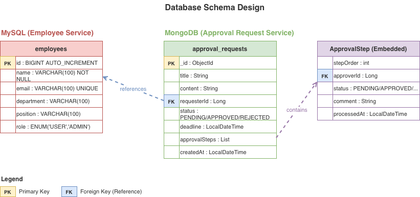

**그림 6-0. 데이터베이스 스키마 다이어그램**

- **MySQL (Employee Service)**: employees 테이블 - 직원 정보 저장
- **MongoDB (Approval Request Service)**: approval_requests 컬렉션 - 결재 요청 문서 저장
- **ApprovalStep (Embedded)**: 결재 단계 정보 (approval_requests 내 임베디드 문서)
- requesterId, approverId는 employees 테이블의 id를 참조

### 6.1 MySQL 스키마 (Employee Service)

**파일 위치:** `scripts/init_mysql.sql`

```sql
CREATE DATABASE IF NOT EXISTS erp_db;
USE erp_db;

CREATE TABLE IF NOT EXISTS employees (
    id BIGINT PRIMARY KEY AUTO_INCREMENT COMMENT '직원 ID',
    name VARCHAR(100) NOT NULL COMMENT '직원 이름',
    department VARCHAR(100) NOT NULL COMMENT '부서',
    position VARCHAR(100) NOT NULL COMMENT '직급',
    created_at DATETIME DEFAULT CURRENT_TIMESTAMP COMMENT '등록일시'
) ENGINE=InnoDB DEFAULT CHARSET=utf8mb4;

-- 초기 데이터
INSERT INTO employees (name, department, position) VALUES
('김요청', '개발팀', '대리'),
('이승인', '개발팀', '팀장'),
('홍길동', '인사팀', '팀장'),
('박결재', '경영팀', '부장'),
('유관리', '경영팀', '이사');
```


**그림 6-1. MySQL employees 테이블 데이터 조회 화면**

터미널에서 MySQL에 접속하여 employees 테이블을 조회한 결과이다. 초기 데이터로 5명의 직원(김요청, 이승인, 홍길동, 박결재, 유관리)이 등록되어 있으며, 각 직원의 부서와 직급 정보가 저장되어 있다.

### 6.2 MongoDB 스키마 (Approval Request Service)

**컬렉션: approval_requests**

```json
{
    "_id": "ObjectId('674d1234abcd5678ef901234')",
    "requestId": 1,
    "requesterId": 1,
    "title": "휴가 신청",
    "content": "연차 3일 사용합니다.\n기간: 12월 20일 ~ 12월 22일",
    "steps": [
        {
            "step": 1,
            "approverId": 2,
            "status": "approved",
            "updatedAt": "2025-12-06T10:30:00"
        },
        {
            "step": 2,
            "approverId": 3,
            "status": "pending",
            "updatedAt": null
        }
    ],
    "finalStatus": "in_progress",
    "createdAt": "2025-12-06T09:00:00",
    "updatedAt": "2025-12-06T10:30:00",
    "deadline": "2025-12-10T18:00:00",
    "reminderSent": false,
    "editHistory": [
        {
            "editedAt": "2025-12-06T09:30:00",
            "editedBy": 1,
            "fieldChanged": "title",
            "oldValue": "휴가 요청",
            "newValue": "휴가 신청"
        }
    ]
}
```


**그림 6-2. MongoDB 결재 요청 컬렉션 데이터 조회 화면**

MongoDB Compass를 통해 approval_requests 컬렉션을 조회한 결과이다. 각 결재 요청은 다단계 결재선(steps 배열), 최종 상태(finalStatus), 기한(deadline), 수정 이력(editHistory) 등의 정보를 포함하고 있다.

### 6.3 필드 상세 설명

**steps.status (단계별 상태):**

| 값 | 설명 | 다음 가능 상태 |
|-------|------|----------------|
| pending | 결재 대기 중 | approved, rejected |
| approved | 승인됨 | pending (철회 시) |
| rejected | 반려됨 | pending (철회 시) |
| cancelled | 취소됨 (선행 단계 반려로 인한 자동 취소) | - |

**finalStatus (최종 상태):**

| 값 | 설명 | 조건 |
|----|------|------|
| in_progress | 진행 중 | 아직 처리 중인 단계가 있음 |
| approved | 최종 승인 | 모든 단계가 approved |
| rejected | 반려됨 | 하나의 단계라도 rejected |
| cancelled | 취소됨 | 요청자가 취소함 |

---

## 7. 환경 구성 및 실행 방법

### 7.1 사전 요구사항

| 항목 | 버전 | 확인 명령어 |
|------|------|------------|
| Java | 17 이상 | `java -version` |
| Docker Desktop | 최신 | `docker --version` |
| Gradle | 8.x (Wrapper 포함) | `./gradlew --version` |

### 7.2 Docker Compose 인프라

**파일 위치:** `docker-compose.yml`

```yaml
version: '3.8'
services:
  mysql:
    image: mysql:8.0
    container_name: erp-mysql
    environment:
      MYSQL_ROOT_PASSWORD: root
      MYSQL_DATABASE: erp_db
    ports:
      - "3306:3306"
    volumes:
      - ./scripts/init_mysql.sql:/docker-entrypoint-initdb.d/init.sql

  mongodb:
    image: mongo:7.0
    container_name: erp-mongodb
    ports:
      - "27017:27017"

  zookeeper:
    image: confluentinc/cp-zookeeper:latest
    container_name: erp-zookeeper
    environment:
      ZOOKEEPER_CLIENT_PORT: 2181

  kafka:
    image: confluentinc/cp-kafka:latest
    container_name: erp-kafka
    depends_on:
      - zookeeper
    ports:
      - "9092:9092"
    environment:
      KAFKA_BROKER_ID: 1
      KAFKA_ZOOKEEPER_CONNECT: zookeeper:2181
      KAFKA_ADVERTISED_LISTENERS: PLAINTEXT://localhost:9092
```

### 7.3 실행 단계

**1. 인프라 시작:**

```bash
# Docker 컨테이너 시작
docker compose up -d

# 컨테이너 상태 확인
docker compose ps
```

**2. 서비스 시작 순서:**

```bash
# 터미널 1: Employee Service
cd employee-service && ./gradlew bootRun

# 터미널 2: Approval Processing Service (Kafka Consumer 먼저 시작)
cd approval-processing-service && ./gradlew bootRun

# 터미널 3: Approval Request Service (Kafka Producer)
cd approval-request-service && ./gradlew bootRun

# 터미널 4: Notification Service
cd notification-service && ./gradlew bootRun

# 터미널 5: Web Service
cd web-service && ./gradlew bootRun
```

**3. 접속 확인:**

| 서비스 | 포트 | 확인 URL |
|--------|------|----------|
| Web Service | 8000 | http://localhost:8000 |
| Employee Service | 8081 | http://localhost:8081/employees |
| Approval Request Service | 8082 | http://localhost:8082/approvals |
| Approval Processing Service | 8083 | http://localhost:8083/process/1 |
| Notification Service | 8080 | http://localhost:8080/notify/1/status |

---

## 8. 테스트 및 개발 과정

이 섹션에서는 각 기능별 테스트 시나리오와 실행 결과, 그리고 개발 과정에서 발견된 문제와 해결 방법을 함께 서술한다.

### 8.1 직원 관리 테스트

직원 관리 기능은 CRUD(Create, Read, Update, Delete) 기본 기능과 권한에 따른 화면 분기를 테스트한다.

**테스트 시나리오:**
1. 일반 사용자로 로그인하여 직원 목록 조회
2. 관리자로 로그인하여 직원 목록 조회 (추가/수정/삭제 버튼 확인)
3. 직원 정보 수정
4. 신규 직원 등록

**실행 결과:**


**그림 8-1. 직원 목록 화면 (일반 사용자)**

일반 사용자(김요청)로 로그인 시 직원 목록은 조회만 가능하다. 추가, 수정, 삭제 버튼이 표시되지 않는다.


**그림 8-2. 직원 목록 화면 (관리자)**

관리자 권한으로 로그인 시 "직원 추가" 버튼과 각 행의 "수정", "삭제" 버튼이 표시된다.


**그림 8-3. 직원 정보 수정 폼**

기존 직원 정보를 수정하는 화면이다. 이름, 부서, 직급을 변경할 수 있다.


**그림 8-4. 신규 직원 등록 폼**

신규 직원을 등록하는 화면이다. 필수 입력 항목(이름, 부서, 직급)을 입력하고 저장 버튼을 클릭하면 MySQL employees 테이블에 데이터가 저장된다.

---

### 8.2 결재 요청 생성 테스트

결재 요청 생성 기능은 다단계 결재선 설정과 함께 테스트한다.

**테스트 시나리오:**
1. 결재 요청 목록 화면 확인
2. 새 결재 요청 폼에서 제목, 내용 입력
3. 최대 4단계까지 결재선 설정
4. 결재 요청 생성 완료

**실행 결과:**


**그림 8-5. 결재 요청 목록 화면**

현재 로그인한 사용자가 생성한 결재 요청 목록이 표시된다. 요청번호, 제목, 결재 단계, 상태, 기한, 생성일 등의 정보를 확인할 수 있다.


**그림 8-6. 결재 요청 생성 폼**

새 결재 요청을 작성하는 화면이다. 제목과 내용을 입력하고 결재선을 설정한다.


**그림 8-7. 4단계 결재선 설정 화면**

최대 4단계까지 결재선을 설정할 수 있다. 각 단계별로 결재자를 드롭다운에서 선택하며, "결재선 추가" 버튼으로 단계를 추가한다. 저장된 결재선 템플릿이 있으면 불러오기도 가능하다.

---

### 8.3 다단계 결재 승인 테스트

2단계 결재 요청을 생성하고 순차적으로 승인하는 흐름을 테스트한다.

**테스트 시나리오:**
1. 김요청이 2단계 결재 요청 생성 (1단계: 이승인, 2단계: 홍길동)
2. 이승인이 결재 대기함에서 요청 확인 후 1단계 승인
3. 홍길동이 결재 대기함에서 요청 확인 후 2단계 승인 (최종 승인)
4. 김요청에게 WebSocket 알림 전달

**실행 결과:**


**그림 8-8. 결재 대기함 (이승인)**

이승인으로 로그인 시 결재 대기함에 자신이 결재해야 할 요청 목록이 표시된다.


**그림 8-9. 결재 상세 화면 (진행 중)**

결재 요청 상세 화면이다. 현재 결재 진행 상황과 각 단계별 상태를 확인할 수 있다. 승인/반려 버튼이 표시된다.

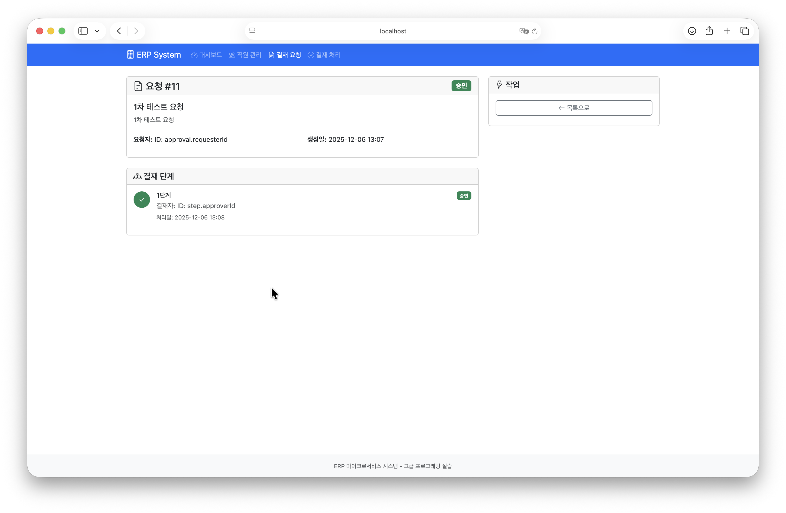

**그림 8-10. 1단계 승인 처리 테스트 결과**

이승인이 1단계를 승인한 후의 화면이다. 터미널 로그에서 승인 처리가 정상적으로 완료되었음을 확인할 수 있다.


**그림 8-11. 결재 상세 (1단계 승인 완료)**

1단계가 승인되어 "approved" 상태로 변경되었고, 이제 2단계 결재자(홍길동)의 차례임을 표시한다.

---

#### 문제 발견: 결재자 ID 표시 오류

테스트 중 결재 상세 화면에서 결재자 이름 대신 "step.approverId"라는 문자열이 그대로 표시되는 버그를 발견했다.

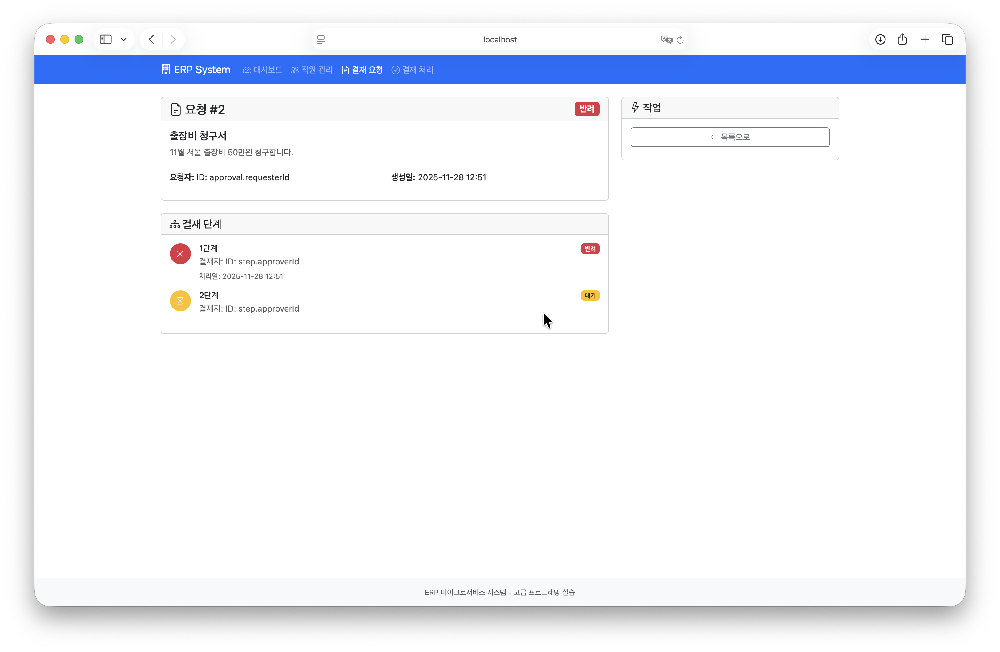

**그림 8-12. 버그 발견 - 결재자 이름 대신 변수명 표시**

"1단계: step.approverId"처럼 Thymeleaf 변수가 렌더링되지 않고 문자열 그대로 출력되는 문제가 발생했다.

**원인 분석:**
- Thymeleaf 템플릿에서 변수 바인딩 문법 오류
- `step.approverId`가 문자열로 출력됨

**해결 방법:**
```html
<!-- 수정 전 (오류) -->
<span th:text="${step.approverId}">step.approverId</span>

<!-- 수정 후 (정상) -->
<span th:text="${approverNames[step.approverId]}">결재자 이름</span>
```

컨트롤러에서 `approverNames` Map을 모델에 추가하여 결재자 ID를 이름으로 변환하도록 수정했다.

---

### 8.4 결재 반려 테스트

3단계 결재 요청에서 중간 단계 반려 시 후속 단계 처리를 테스트한다.

**테스트 시나리오:**
1. 김요청이 3단계 결재 요청 생성 (1단계: 이승인, 2단계: 홍길동, 3단계: 박결재)
2. 이승인이 1단계 승인
3. 홍길동이 2단계 반려
4. 3단계 상태가 자동으로 cancelled로 변경되는지 확인

**실행 결과:**

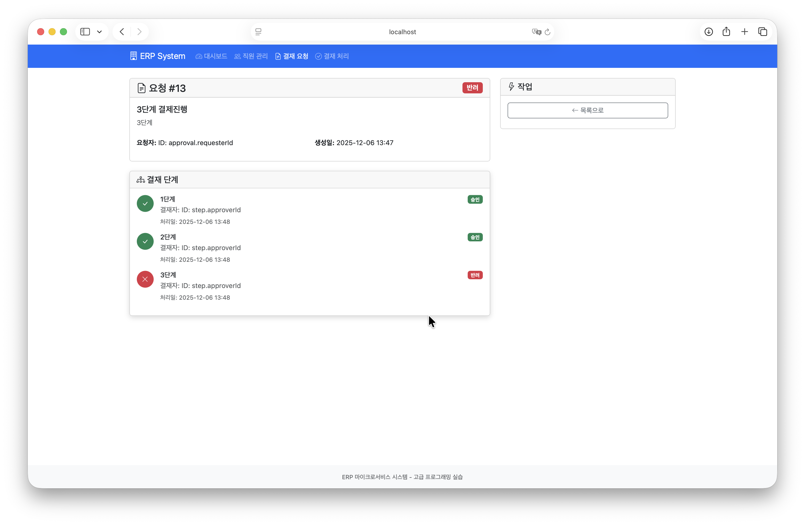

**그림 8-13. 3단계 결재 흐름 테스트**

1단계, 2단계까지 승인 완료 후 3단계에서 반려하는 시나리오를 테스트했다.

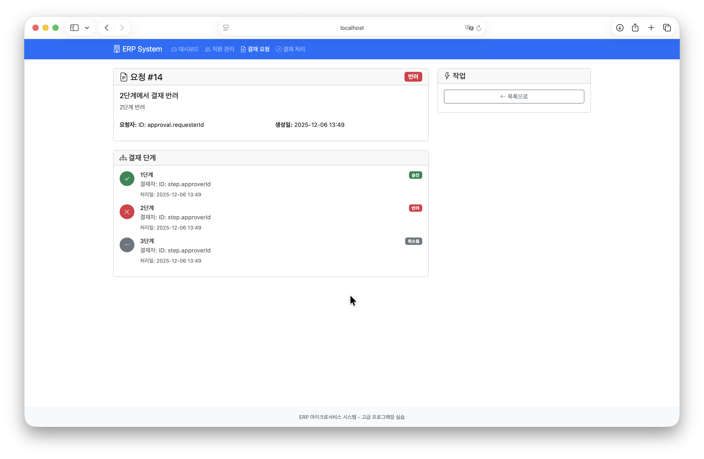

**그림 8-14. 2단계 반려 시 3단계 자동 취소**

2단계에서 반려 시 후속 단계인 3단계가 자동으로 "cancelled" 상태로 변경되었다.

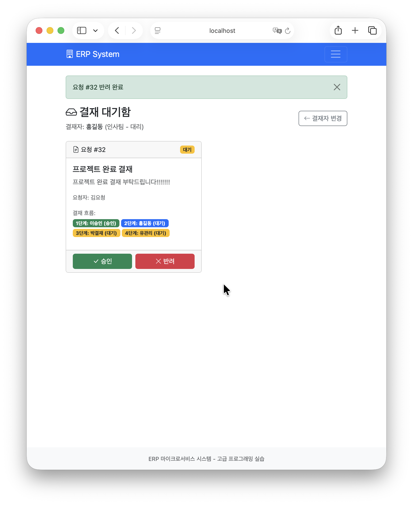

**그림 8-15. 결재 대기함 (홍길동) - 반려 처리 후**

홍길동이 반려 처리를 완료한 후의 결재 대기함 화면이다.

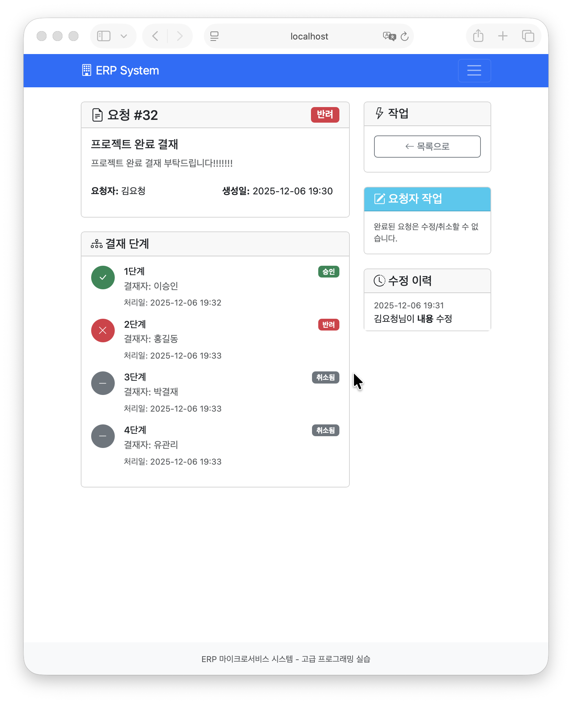

**그림 8-16. 결재 상세 - 2단계 반려로 3단계 취소됨**

2단계가 "rejected" 상태이고, 3단계는 "cancelled" 상태로 자동 변경되었다. finalStatus는 "rejected"이다.

---

#### 문제 발견: 후속 단계 상태 미처리

초기 구현에서는 반려 시 후속 단계 상태가 그대로 "pending"으로 유지되는 버그가 있었다.

**원인 분석:**
- 반려 처리 시 후속 단계 상태 업데이트 로직 누락

**해결 방법:**
```java
// ApprovalRequestService.java
public void processApprovalResult(ApprovalResultMessage result) {
    ApprovalRequestDocument doc = findById(result.getRequestId());

    // 해당 단계 상태 업데이트
    doc.getSteps().get(result.getStep() - 1).setStatus(result.getStatus());

    if ("rejected".equals(result.getStatus())) {
        // 반려 시 후속 단계 모두 cancelled로 변경
        for (int i = result.getStep(); i < doc.getSteps().size(); i++) {
            doc.getSteps().get(i).setStatus("cancelled");
        }
        doc.setFinalStatus("rejected");
    }

    repository.save(doc);
}
```

---

### 8.5 WebSocket 실시간 알림 테스트

결재 처리 시 요청자에게 실시간으로 알림이 전달되는지 테스트한다.

**테스트 시나리오:**
1. 김요청이 대시보드에서 대기
2. 이승인이 김요청의 결재 요청을 승인
3. 김요청의 화면에 실시간 알림 팝업 표시 확인

**실행 결과:**


**그림 8-17. 대시보드 - 새 결재 요청 알림 수신**

새 결재 요청이 도착했을 때 대시보드에 알림이 표시된다.

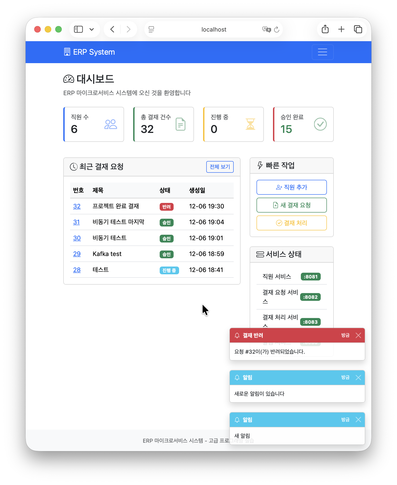

**그림 8-18. 대시보드 - 반려 알림 수신**

결재가 반려되었을 때 요청자에게 반려 알림이 전달된다.


**그림 8-19. WebSocket 실시간 알림 팝업**

WebSocket을 통해 실시간으로 알림이 전달되어 화면 우측 상단에 팝업으로 표시된다.


**그림 8-20. 새 결재 요청 실시간 알림 (요청 #30)**

결재자에게 새 결재 요청이 도착했음을 알리는 실시간 알림이다. "결재 요청 #30이(가) 승인되었습니다" 메시지가 표시된다.


**그림 8-21. 승인 완료 시 이중 알림 팝업**

결재가 완료되면 알림 팝업과 함께 브라우저 상단에 "새로운 알림이 있습니다" 배너가 표시된다.

---

#### 문제 발견: WebSocket 알림 미수신

테스트 중 결재 처리 후 요청자에게 알림이 전달되지 않거나 지연되는 문제가 발생했다.

**원인 분석:**
1. 서버에서 알림 전송 후 5ms 만에 HTTP 응답 반환
2. 클라이언트가 페이지 이동 시 WebSocket 연결 끊김
3. `sendPendingNotifications()` 500ms 지연 중 연결 해제

**해결 방법:**

서버 측 수정 (NotificationWebSocketHandler.java):
```java
// 대기 시간 단축
Thread.sleep(100);  // 500ms → 100ms

// 알림 전송 후 즉시 세션 상태 확인
if (session.isOpen()) {
    session.sendMessage(new TextMessage(jsonMessage));
}
```

클라이언트 측 수정 (common.js):
```javascript
// 자동 재연결 로직 추가
ws.onclose = function() {
    console.log('WebSocket 연결 끊김, 3초 후 재연결...');
    setTimeout(function() {
        connectWebSocket(employeeId);
    }, 3000);
};
```

---

### 8.6 승인 철회 테스트

이미 승인한 결재를 철회하는 기능을 테스트한다.

**테스트 시나리오:**
1. 이승인이 결재 요청 승인
2. 승인 완료된 결재에서 "철회" 버튼 클릭
3. 해당 단계 상태가 pending으로 복원되고 다시 결재 대기함에 표시되는지 확인

**실행 결과:**

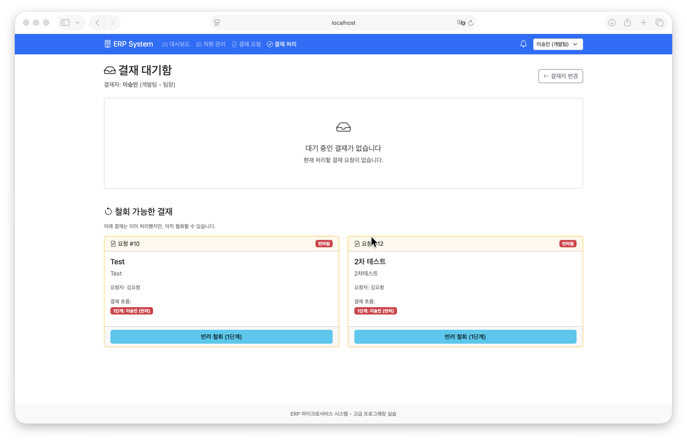

**그림 8-22. 승인 철회 기능 테스트 (이승인)**

이승인이 이미 승인한 결재를 철회하는 화면이다. "승인 철회" 버튼을 클릭하면 해당 단계가 다시 pending 상태로 변경된다.

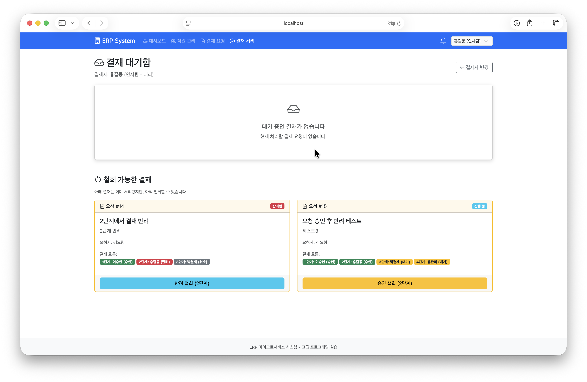

**그림 8-23. 반려 철회 기능 테스트 (홍길동)**

홍길동이 반려한 결재도 철회할 수 있다. 철회 시 해당 단계부터 다시 결재를 진행할 수 있다.

---

### 8.7 결재 기한 기능 테스트

결재 요청에 기한을 설정하고 기한 초과 시 표시가 변경되는지 테스트한다.

**테스트 시나리오:**
1. 결재 요청 생성 시 기한 설정
2. 기한 전 요청과 기한 초과 요청의 표시 차이 확인

**실행 결과:**

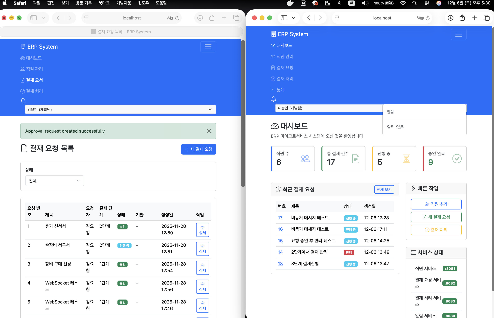

**그림 8-24. 결재 기한 필드 추가 테스트**

결재 요청 목록에 기한 필드가 추가되었다. 각 요청별로 기한이 표시된다.

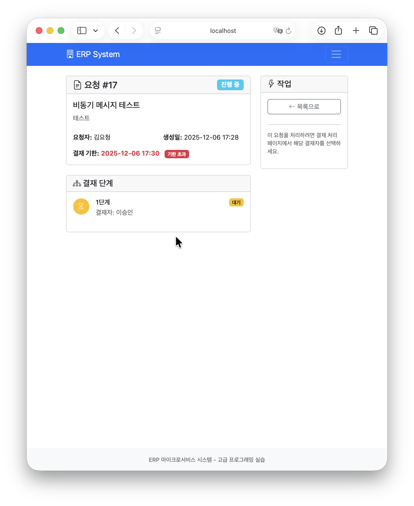

**그림 8-25. 기한 초과 시 빨간색 "기한 초과" 표시**

기한이 지난 결재 요청은 기한 열에 빨간색으로 "기한 초과"가 표시된다.

---

### 8.8 결재 요청 수정/취소 테스트

요청자가 진행 중인 결재 요청을 수정하거나 취소하는 기능을 테스트한다.

**테스트 시나리오:**
1. 요청자가 자신이 생성한 결재 요청 상세 페이지 접속
2. "수정" 또는 "취소" 버튼 확인
3. 수정 시 이력 추적 확인

**실행 결과:**

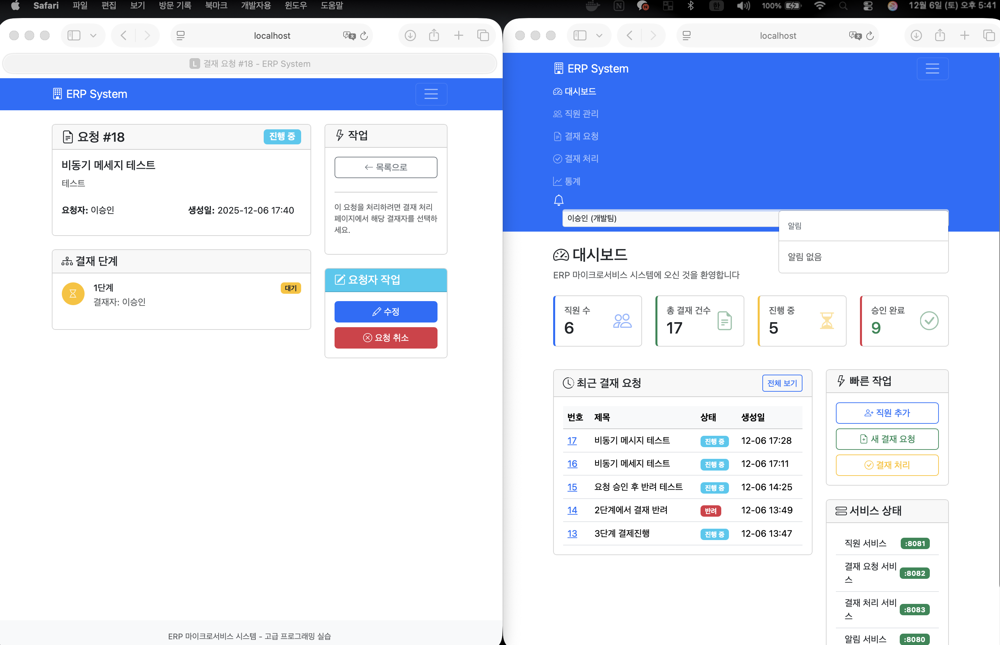

**그림 8-26. 요청자 화면 - 수정/취소 버튼**

요청자가 자신이 생성한 결재 요청을 조회할 때 "수정"과 "취소" 버튼이 표시된다. 진행 중인 결재만 수정/취소가 가능하다.

수정 시에는 수정 이력이 자동으로 기록되어 언제, 누가, 어떤 필드를 어떻게 변경했는지 추적할 수 있다.

---

### 8.9 Kafka 비동기 메시징 테스트

gRPC에서 Kafka로 전환한 비동기 메시징이 정상 동작하는지 대량 처리 테스트를 진행한다.

**테스트 시나리오:**
1. 다수의 결재 요청 생성
2. Kafka를 통해 Processing Service로 메시지 전달 확인
3. 결과 메시지가 Request Service로 정상 수신되는지 확인

**실행 결과:**

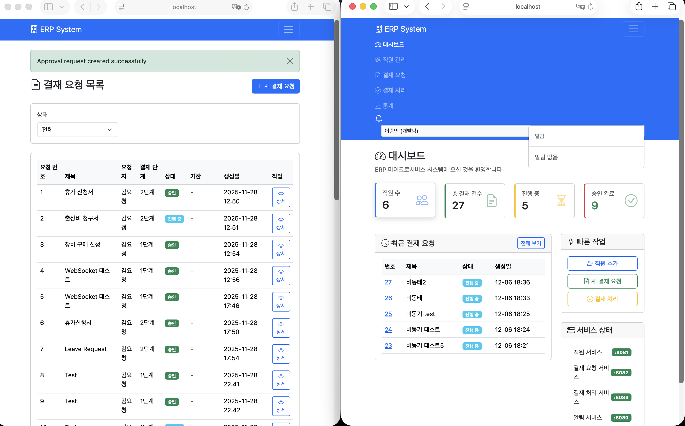

**그림 8-27. Kafka 비동기 메시징 테스트 (총 27건 처리)**

27건의 결재 요청을 처리하는 테스트를 진행했다. Kafka를 통한 비동기 메시징으로 Processing Service 장애 시에도 Request Service가 정상 동작하며, 메시지 유실 없이 처리되었다.

**gRPC에서 Kafka로 전환한 이유:**
- **느슨한 결합**: 서비스 간 직접 호출 대신 메시지 브로커를 통한 통신
- **장애 격리**: 한 서비스 장애가 다른 서비스에 영향을 주지 않음
- **메시지 영속화**: 네트워크 장애 시에도 메시지 유실 방지

---

### 8.10 결재 순서 오류 처리 테스트

자신의 결재 차례가 아닌 결재자가 승인을 시도할 때 오류 처리가 정상적으로 되는지 테스트한다.

**테스트 시나리오:**
1. 2단계 결재 요청 생성 (1단계: 이승인, 2단계: 홍길동)
2. 홍길동이 1단계 결재자보다 먼저 승인 시도
3. 에러 메시지 표시 확인

**실행 결과:**

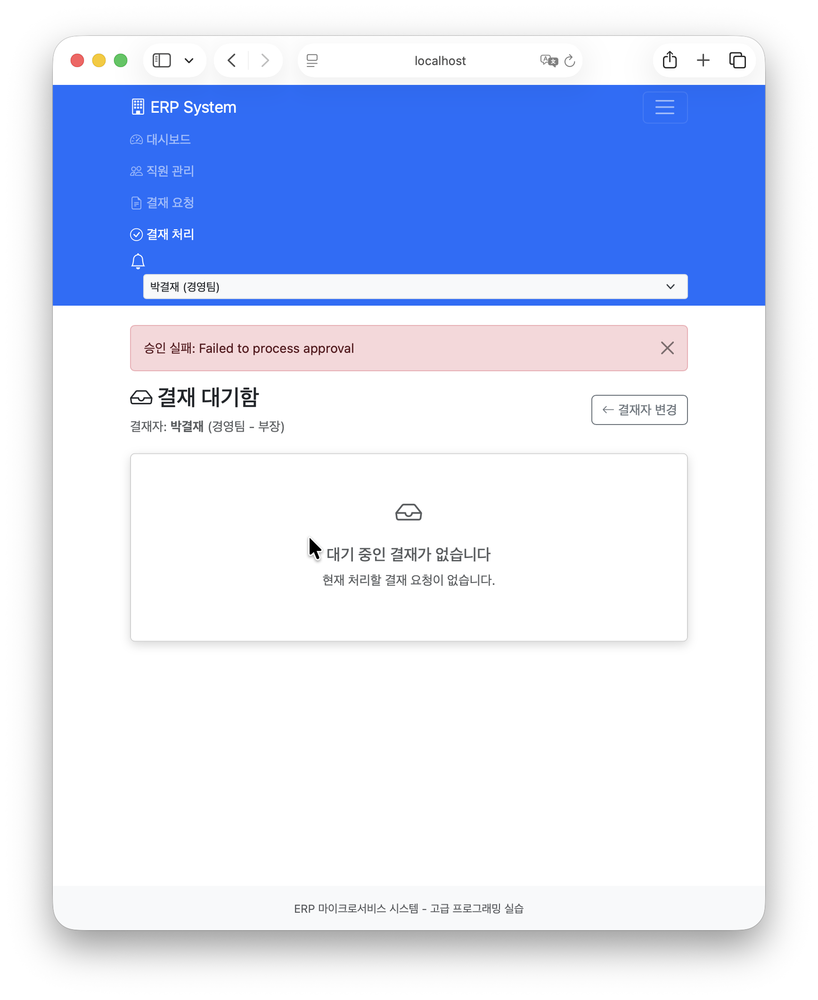

**그림 8-28. 결재 순서 오류 시 에러 메시지**

자신의 결재 차례가 아닌 결재자가 승인을 시도하면 "Failed to process approval" 에러 메시지가 표시된다. 결재는 반드시 순서대로 진행되어야 한다.

**구현 코드:**
```java
// ProcessingService.java
public void processApproval(int approverId, int requestId, String status) {
    ApprovalRequest request = findPendingRequest(approverId, requestId);

    if (request == null) {
        throw new ApprovalException("승인 실패: Failed to process approval");
    }

    // 현재 단계 결재자인지 확인
    int currentStep = findCurrentStep(request);
    if (request.getSteps().get(currentStep).getApproverId() != approverId) {
        throw new ApprovalException("현재 결재 순서가 아닙니다.");
    }

    // 처리 진행...
}
```

---

## 9. 확장 기능 구현

### 9.1 Kubernetes 배포 (10점)

**파일 위치:** `k8s/` 폴더

#### 매니페스트 파일 구성

| 파일명 | 용도 |
|--------|------|
| namespace.yaml | erp 네임스페이스 생성 |
| configmap.yaml | 서비스별 환경 변수 |
| secret.yaml | DB 비밀번호 등 민감 정보 |
| mysql.yaml | MySQL StatefulSet + Service |
| mongodb.yaml | MongoDB StatefulSet + Service |
| kafka.yaml | Kafka + Zookeeper Deployment |
| employee-service.yaml | Employee Service Deployment |
| approval-request-service.yaml | Approval Request Service Deployment |
| approval-processing-service.yaml | Approval Processing Service Deployment |
| notification-service.yaml | Notification Service Deployment |
| web-service.yaml | Web Service Deployment |
| deploy.sh | 전체 배포 스크립트 |

#### 배포 명령어

```bash
# 네임스페이스 생성
kubectl apply -f k8s/namespace.yaml

# 설정 적용
kubectl apply -f k8s/configmap.yaml
kubectl apply -f k8s/secret.yaml

# 인프라 배포
kubectl apply -f k8s/mysql.yaml
kubectl apply -f k8s/mongodb.yaml
kubectl apply -f k8s/kafka.yaml

# 서비스 배포
kubectl apply -f k8s/employee-service.yaml
kubectl apply -f k8s/approval-request-service.yaml
kubectl apply -f k8s/approval-processing-service.yaml
kubectl apply -f k8s/notification-service.yaml
kubectl apply -f k8s/web-service.yaml

# 상태 확인
kubectl get pods -n erp
```

#### Kubernetes 배포 아키텍처

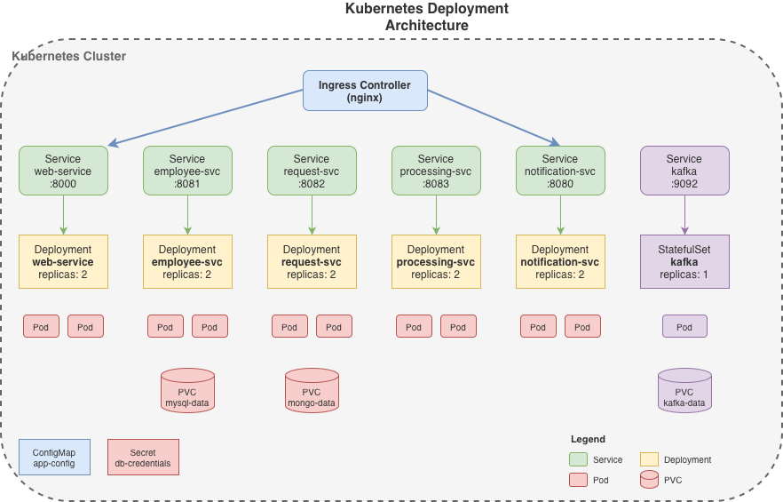

**그림 9-0. Kubernetes 배포 아키텍처**

- **Ingress Controller**: 외부 트래픽을 클러스터 내부 서비스로 라우팅
- **Service**: 각 마이크로서비스에 대한 ClusterIP 서비스
- **Deployment**: 각 서비스별 replicas: 2로 고가용성 구성
- **StatefulSet**: Kafka는 상태 유지를 위해 StatefulSet으로 배포
- **PVC**: MySQL, MongoDB, Kafka 데이터 영속화
- **ConfigMap/Secret**: 환경 설정 및 민감 정보 관리

---

### 9.2 Kafka 비동기 메시징 (10점)

8.9 섹션에서 설명한 바와 같이, gRPC 동기 방식에서 Kafka 비동기 방식으로 전환하여 구현했다.

#### 구현 내용

- 토픽: `approval-requests`, `approval-results`
- Consumer Group을 통한 부하 분산 지원
- 메시지 영속화로 유실 방지

#### Kafka 설정 (application.yml)

```yaml
spring:
  kafka:
    bootstrap-servers: localhost:9092
    consumer:
      group-id: approval-group
      auto-offset-reset: earliest
      key-deserializer: org.apache.kafka.common.serialization.StringDeserializer
      value-deserializer: org.springframework.kafka.support.serializer.JsonDeserializer
      properties:
        spring.json.trusted.packages: "*"
    producer:
      key-serializer: org.apache.kafka.common.serialization.StringSerializer
      value-serializer: org.springframework.kafka.support.serializer.JsonSerializer
```

---

### 9.3 창의적 기능 구현 (30점)

#### 9.3.1 웹 프론트엔드 UI

**기술 스택:** Thymeleaf + Bootstrap 5

직접 개발한 웹 프론트엔드를 통해 모든 기능을 GUI로 사용할 수 있다. 8.1~8.2 섹션의 스크린샷에서 확인할 수 있듯이 직관적인 UI를 제공한다.

**주요 화면:**
- 대시보드 (통계, 최근 결재, 서비스 상태)
- 직원 관리 (CRUD)
- 결재 요청 목록/생성/상세
- 결재 대기함
- 결재선 템플릿 관리

#### 9.3.2 결재 통계 대시보드


**그림 9-1. 결재 통계 대시보드 화면**

대시보드에서 전체 시스템 현황을 한눈에 파악할 수 있다:
- 직원 수
- 총 결재 건수
- 진행 중 건수
- 승인 완료 건수
- 반려 건수
- 최근 결재 요청 목록
- 서비스 상태 모니터링

#### 9.3.3 결재선 템플릿


**그림 9-2. 결재선 템플릿 생성 화면**

자주 사용하는 결재선을 템플릿으로 저장하여 재사용할 수 있다:
- 템플릿 이름 설정
- 결재선 단계 구성
- 저장/불러오기/삭제 기능

#### 9.3.4 결재 요청 수정/취소

8.8 섹션에서 확인한 바와 같이 요청자는 진행 중인 결재 요청을 수정하거나 취소할 수 있다:
- 진행 중인 결재만 수정/취소 가능
- 수정 시 이력 자동 추적
- 수정일시, 수정자, 변경 필드, 이전/현재 값 저장

#### 9.3.5 승인 철회

8.6 섹션에서 확인한 바와 같이 이미 승인한 결재를 철회할 수 있다:
- 승인 후에도 철회 가능
- 철회 시 해당 단계 상태가 pending으로 복원
- 다시 결재 대기함에 표시

#### 9.3.6 결재 기한 및 리마인더

8.7 섹션에서 확인한 바와 같이 결재 기한 기능을 구현했다:
- 결재 요청 시 기한 설정 가능
- 기한 초과 시 빨간색 "기한 초과" 표시
- 리마인더 발송 스케줄러 구현 (DeadlineReminderScheduler)

---

## 부록: 주요 코드 파일 위치

### A. Employee Service

| 파일 | 경로 |
|------|------|
| Controller | employee-service/src/main/java/com/erp/employee/controller/EmployeeController.java |
| Entity | employee-service/src/main/java/com/erp/employee/entity/Employee.java |
| Repository | employee-service/src/main/java/com/erp/employee/repository/EmployeeRepository.java |
| Service | employee-service/src/main/java/com/erp/employee/service/EmployeeService.java |

### B. Approval Request Service

| 파일 | 경로 |
|------|------|
| Controller | approval-request-service/src/main/java/com/erp/request/controller/ApprovalRequestController.java |
| Document | approval-request-service/src/main/java/com/erp/request/document/ApprovalRequestDocument.java |
| Repository | approval-request-service/src/main/java/com/erp/request/repository/ApprovalRequestRepository.java |
| Service | approval-request-service/src/main/java/com/erp/request/service/ApprovalRequestService.java |
| Kafka Producer | approval-request-service/src/main/java/com/erp/request/kafka/ApprovalRequestKafkaProducer.java |
| Kafka Consumer | approval-request-service/src/main/java/com/erp/request/kafka/ApprovalResultKafkaConsumer.java |

### C. Approval Processing Service

| 파일 | 경로 |
|------|------|
| Controller | approval-processing-service/src/main/java/com/erp/processing/controller/ProcessingController.java |
| Service | approval-processing-service/src/main/java/com/erp/processing/service/ProcessingService.java |
| Kafka Consumer | approval-processing-service/src/main/java/com/erp/processing/kafka/ApprovalRequestKafkaConsumer.java |
| Kafka Producer | approval-processing-service/src/main/java/com/erp/processing/kafka/ApprovalResultKafkaProducer.java |

### D. Notification Service

| 파일 | 경로 |
|------|------|
| Controller | notification-service/src/main/java/com/erp/notification/controller/NotificationController.java |
| WebSocket Handler | notification-service/src/main/java/com/erp/notification/handler/NotificationWebSocketHandler.java |
| Config | notification-service/src/main/java/com/erp/notification/config/WebSocketConfig.java |

### E. 설정 파일

| 파일 | 경로 |
|------|------|
| Proto 파일 | proto/approval.proto |
| Docker Compose | docker-compose.yml |
| MySQL 초기화 | scripts/init_mysql.sql |
| K8s 매니페스트 | k8s/*.yaml |

---

**문서 끝**
